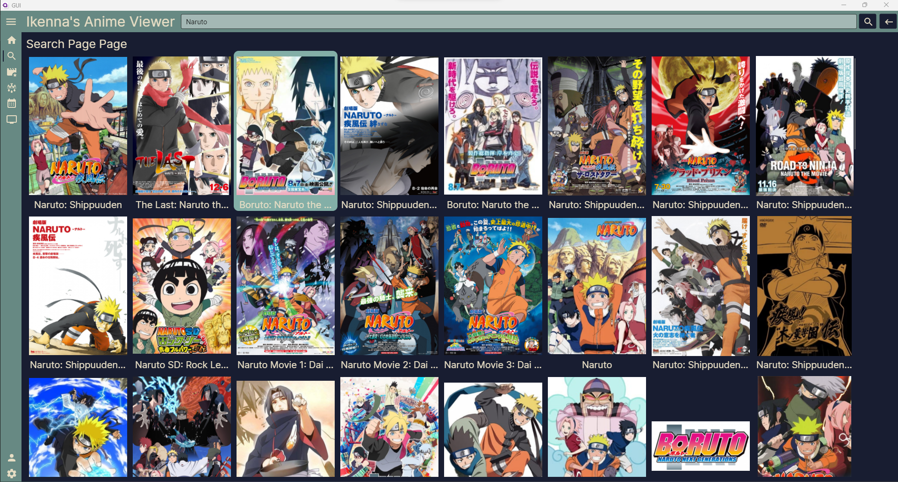
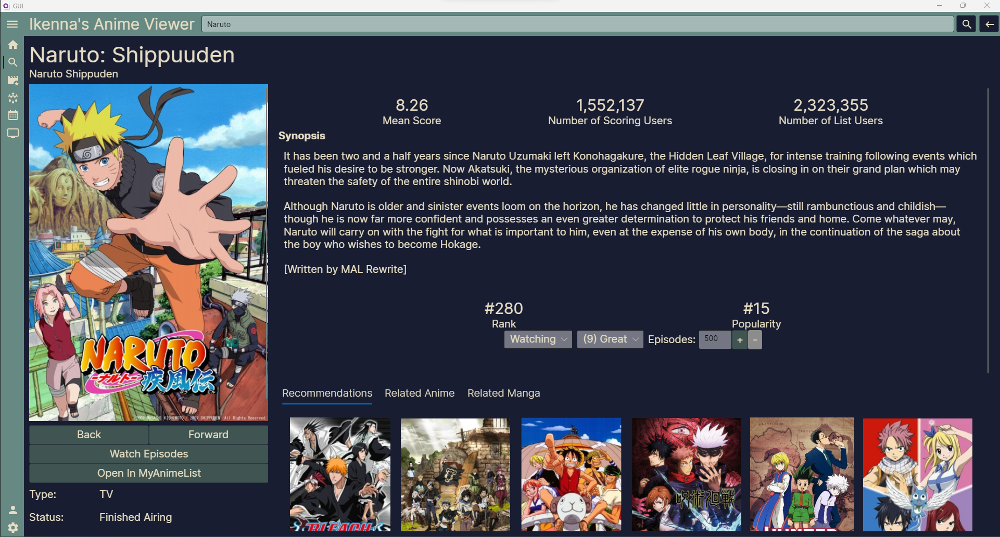
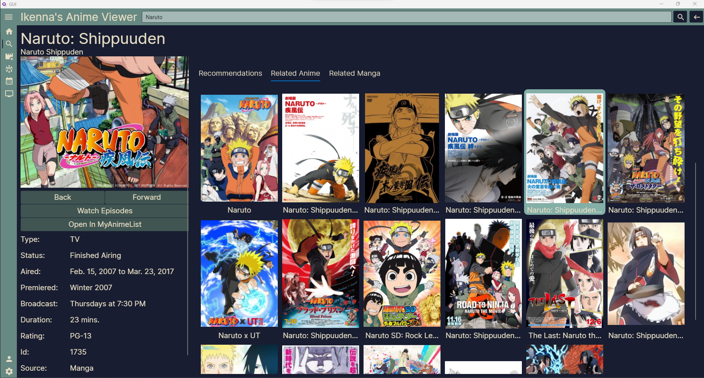
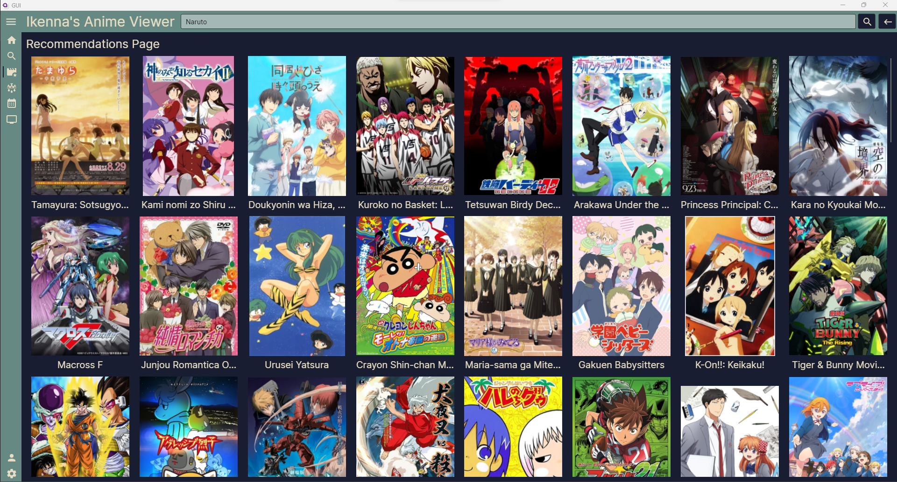
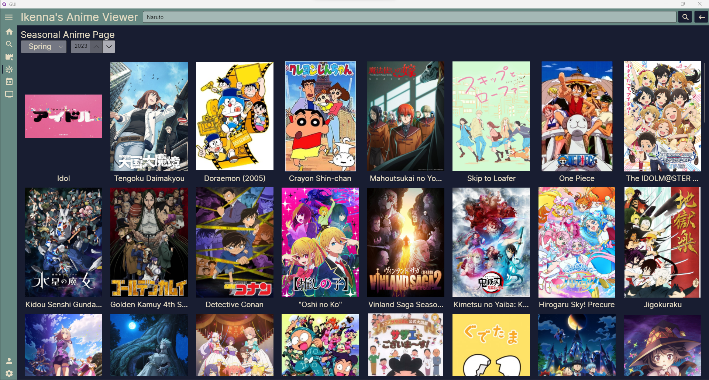
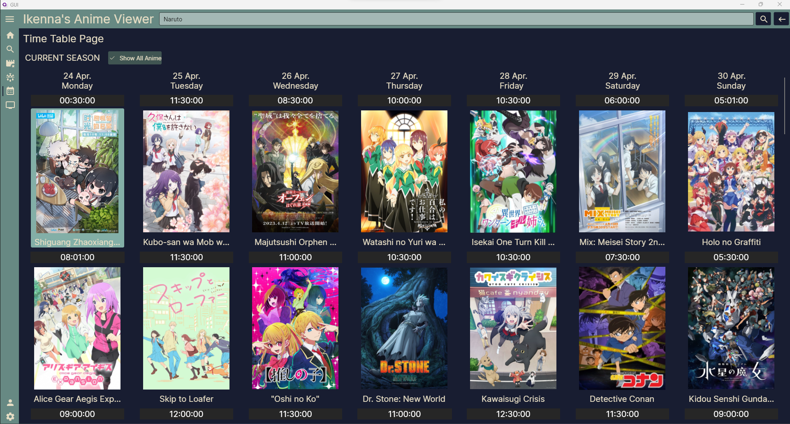
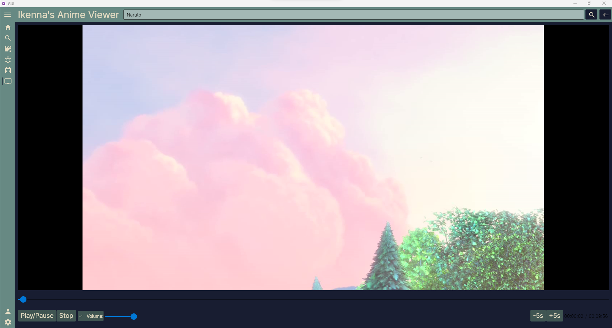

# Anime-Desktop-App

The purpose of this app is to learn a new language! (C#) And learn about why C# may be better or worse than other languages. Additionally, I will use it to acquire some more programming standards and techniques.

Anime-Desktop-App is first and foremost a wrapper client for MyAnimeList.net. It will allow the user to do everything a user can do on the web version, and more, but through a desktop cross-platform experience (because we all know desktop is superior).

Additionally, there will be support for directly streaming anime through the app, skipping filler episodes, and skipping the intro/outro.

## Walk Through

Below is a collection of some of the pages the app offers

### Search

### Anime Details

### User Specific Recommendations

### Seasonal Anime

### Timetable Subbed/Dubbed/Raw

### Video Player

## TODO:
- [ ] Add Support for video streaming
  - [ ] Include support for poppping out the streamer into its own window
  - [ ] Add support for skipping intro using user defined buttons or public dbs
- [ ] Add support for viewing profiles
  - [ ] Add a logged in user profile page 
- [ ] Add support for reading manga
- [ ] Add Notification system for when new anime comes out

## About This Repo

This repository can be divided into 3 major parts, the GUI, the web scrapper, and the C# MyAnimeList Wrapper.
Currently, contributions were made solely by me the repo owner and nice fellows on stackoverflow and github issues.

## Contributing 
All are welcoming to contribute how much or how little you can.
1. Fork the repository
2. Create a new branh with a short but informative title
3. Make which ever change you think would be a nice addition
4. Make a pull request

## Special Thanks To:
- Avalonia - framework this application was designed in
- MyAnimeList - used to build the wrapper which powers the backend of this app (I am not affiliated with MyAnimeList)
- Animeschedule.net - used for subbed and dubbed time table information
- LibVLCSharp - powers the video player